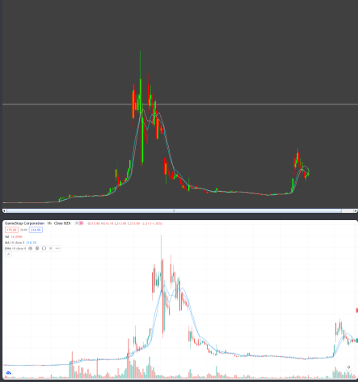

# Practicum_OOP
Project for my "Practicum in Object-Oriented programming" class where we implemented C++ program that gathers data using cURL library then parses JSON file and Java program that visuelized data that C++ parsed.

  
  </n>
  </n>
  
Mine VS from a website 

</n>
</n>

  
  </n>
  </n>
  
App window

</n>
</n>

Crawler.java is missing path to .exe file fo you need to add it, also C++ has two Source.cpp files "ORIGINAL" contains working main with a working loop to test features to gather data and process it, "FINAL" has the main that is used in exe file and just prints parsed data to standard output 

